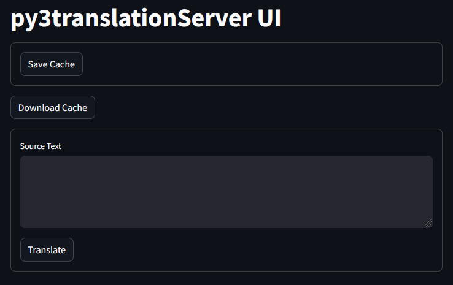

# py3translationServer

py3translationServer is an HTTP fontend for [fairseq](//github.com/facebookresearch/fairseq) and [CTranslate2](//github.com/OpenNMT/CTranslate2) inference software implemented with the [Tornado](//www.tornadoweb.org) web framework.

- [fairseq](//github.com/facebookresearch/fairseq) is a machine learning and data training framework originally written by Meta/Facebook.
- [CTranslate2](//github.com/OpenNMT/CTranslate2) is a C++ and Python library for [efficient inference](//github.com/OpenNMT/CTranslate2#gpu) with transformer models.
- The emphasis of this project is to expose natural language translation models via a JSON interface. This allows other programs to submit translation requests and recieve responses of the translated text.
- There is also a small UI included.



- Dark mode shown.
- Aside:
    - To translate text files, try [py3TranslateLLM](//github.com/gdiaz384/py3TranslateLLM).
    - To translate manga, try [manga-image-translator](//github.com/zyddnys/manga-image-translator).
    - Sugoi Toolkit also has tools for translating manga.

## Key Features:

- Supports model formats supported by fairseq and CTranslate2.
- Supports large batch sizes.
- Supports caching results for instant servicing time of previously translated requests.
- Supports both multiprocess mode and model preloading.
    - Multiprocess mode, the default, is better for long term stability and batch translations.
    - Preloading models allows for low latency inferencing at the cost of having to manage memory manually.
- Supports JSON for application agnostic I/O with a documented API.
    - Supports integration with [Translator++](//dreamsavior.net) and [Sugoi Toolkit](//sugoitoolkit.com).
    - See: **Regarding Memory Managment** for information on how to configure Translator++.
- Supported on Windows and Linux.
    - Tested and developed on Windows but should also work on Linux.
    - [Open an issue](//github.com/gdiaz384/py3translationServer/issues/new) if anything does not work on Linux.
    - OS/X, BSD, Android, IOS are not officially supported but might work regardless.
- Makes comparing different NMT models easier.
- Makes comparing fairseq and CTranslate2's various supported devices easier, especially on different hardware and also with different versions of fairseq, CTranslate2, and PyTorch.
- Supports fully asyncronous multiprocessing and asyncronous multithreading for non-blocking network I/O.

## Planned:

- Support for additional model formats.
    - Currently only models with associated sentencepiece models for their vocabulary are supported.
    - This limitation is somewhat arbitrary, so please [open an issue](//github.com/gdiaz384/py3translationServer/issues/new) to request support for your model type if this limitation is harmful to your use case. Remember to specify a model type, the byte pair encoding type, and provide an example model for development purposes.
- Support for additional acceleration modes for CTranslate2, especially cuDNN.
    - Update: CTranslate2 does not really expose its internals.
    - It just has a very barebones interface consisting of [3 device modes](https://opennmt.net/CTranslate2/python/ctranslate2.Translator.html): `cpu`, `cuda`, and `auto`.
    - It might be transparently using cuDNN if it is available, but it is also not clear how to check if it actually is using it or not.
- Add optional CTranslate2 [vocabulary mapping, vmap](//opennmt.net/CTranslate2/translation.html#dynamic-vocabulary-reduction), support for even faster inferencing.
    - Update: It looks like it has to be constructed in a special way.
    - https://github.com/OpenNMT/papers/tree/master/WNMT2018/vmap
- Broader application compatibility.
    - [XUnity.AutoTranslator](//github.com/bbepis/XUnity.AutoTranslator) especially.
        - Update: Can test it with [this project](//github.com/Vin-meido/XUnity-AutoTranslator-SugoiOfflineTranslatorEndpoint).
    - Also: https://github.com/zyddnys/manga-image-translator
- Better support for DirectML.
    - DirectML has been implemented for fairseq but requires a very old fairseq version to work. See: **Known Bugs and Limitations**.
    - Update: It is as well supported as it is ever going to get. The only thing left would be to trace the fairseq source tree one commit at a time to see why an old fairseq version is needed for it.
- **Tip: [Open an issue](//github.com/gdiaz384/py3translationServer/issues/new) for feature requests, like requesting interlopability with a specific model format or application.**

## Maybe:

- Reduce JSON dependency for I/O.
    - Alternatives?
- Support for [Textractor](//github.com/Artikash/Textractor).
    - Does Textractor support sending stuff to the clipboard or some other read-able resource?
    - Maybe with an extension/plugin? Which one?
    - If py3translationServer reads from the clipboard or other non-standard input, anything besides HTTP POST + JSON input, what should be done with the result? Just print it to the console and add it to the cache file? Should it make the results temporarily available at any URL maybe? How does the client know the updated resource is available? The next request would clobber this temporary data at the URL. Is that intentional?
    - Basically, what application/textractor plugin should be supported and how does it work?
    - Textractor only extracts text. It should really be up to a Textractor plugin to add support for sending HTTP POST requests that submit JSON via a known API and return the result without having to change anything server-side. There is not any sensible way to add support for it server side besides just processing the requests in a sane way.
    - Update: It seems there is a [plugin](https://github.com/Artikash/Textractor/pull/699) for Sugoi in Textractor. Need to test it.
- Support for [fairseq2](//github.com/facebookresearch/fairseq2).
    - fairseq2 is linux only.
    - There are already good APIs for LLM models like KoboldCPP and OpenAI's GPT and related interfacing software, so unclear what the use case for adding this here would be.
    - In terms of translating natural language, there are few to no benefits LLM models have over NMT models if not using context, but using context interferes with batch translations. So, there are conflicting goals with py3translationServer as well.
- ROCm on Linux.
    - Would require baremetal Linux or WSL2 + a supported AMD GPU for development purposes.
- Add URL support to print out the sha1 hash of the current model.
    - How would this be useful?
- Compress cache.csv to cache.csv.zip to save diskspace.

## Example Usage Guide:

1. Open the included script file with a text editor:
    - Windows: `py3translationServer.py.bat`
    - Linux: `py3translationServer.py.sh`  TODO: Add this.
1. Update the mode: `fairseq`, or `ctranslate2`
1. Update the base modelPath. Examples:
    - `set modelPath=D:\model_ct2\model.bin`
    - `set modelPath=D:\models\myModel.pt`
1. Specify the source and target languages, and the sentencepiece models for each.
    - There is some code to help find the models based upon only the specified language or to extract the language if only the sentencepiece model was specified. However, one or the other must be specified at runtime: the language or the model.
    - For automatic detection, the models must be named very similarly to `spm.ja.nopretok.model` and differ only in the [ ISO 639-1 code](//www.loc.gov/standards/iso639-2/php/code_list.php).
    - The sentencepiece models must also be in in the same folder as `modelPath`, the parent folder, or subfolder named `spm`, `spmModel`, or `spmModels`.
1. Update the device to one of the following: `cpu`, `gpu`, `cuda`, `directml`.
    - `gpu` is aliased to `cuda`.
    - `directml` is only valid on Windows + `fairseq` and requires special versions of everything.
    - `rocm` for linux is not yet supported.
1. Run the script file.
    - Start a command prompt or terminal and run it or double click on it from the file explorer.

```
Syntax: [ ] means fill in the blank.
python py3translationServer [mode] [modelPath] --sourceLanguage [] --targetLanguage [] --sourceSentencePieceModel [] --targetSentencePieceModel []

Syntax Help:
py3translationServer -h
py3translationServer --help

Basic Usage:
py3translationServer fairseq D:\myModel\pretrained.pt --sourceLanguage ja --targetLanguage en --sourceSentencePieceModel myModel/spm.ja.nopretok.model --targetSentencePieceModel myModel/spm.en.nopretok.model

py3translationServer ctranslate2 D:\myModel --sourceLanguage ja --targetLanguage en --sourceSentencePieceModel myModel/spm.ja.nopretok.model --targetSentencePieceModel myModel/spm.en.nopretok.model --device cuda

Advanced Usage:
See: Parameters.
```

### Parameters

Parameter | Optional or Required | Description | Examples
--- | --- | --- | ---
`--help` ; `-h` | Optional. | Show help text and exit. | `--help` ; `-h`
mode | Required. | Model engine to use. Must be `fairseq` or `ctranslate2` | `fairseq` ; `ctranslate2` 
modelPath | Required. | The path to the model to use with the chosen engine. For `ctranslate2`, only the base folder path is needed. | `D:\ myModel\ model.pt` ; `/home /user /ct2_model/`
`--device` ; `-dev` | Optional. | Process the model using `cpu`, `gpu`, `cuda`, or `directml`. `gpu` is aliased to `cuda`. `directml` is only valid for `fairseq`. `rocm` is not supported yet. Default=`cpu`. | `--device cpu` ; `-dev cuda`
`--sourceLanguage` ; `-sl` | Required. | The source language to translate from. Use the two letter code. | `--sourceLanguage ja` ; `-sl en`
`--targetLanguage` ; `-tl` | Required. | The target language to translate to. Use the two letter code. | `--targetLanguage en` ; `-tl ja`
`--sourceSentencePieceModel` ; `-sspm` | Required. | The sentence piece model for the source language. | `--sspm D:\ myModel\ spm\ spm.ja.nopretok.model`
`--targetSentencePieceModel` ; `-tspm` | Depends on mode. | The sentence piece model for the target language. Required for CTranslate2. | `--tspm D:\ myModel\ spm\ spm.en.nopretok.model`
`--preloadModel` ; `-pm` | Optional. | Preload the model for lower latency inferencing. Requires manual memory management. Default is to not preload the model. | `--preloadModel` ; `-pm`
`--cpuThreads` ; `-t` | Optional. | Specify the number of CTranslate2 CPU threads. psutil optimizes this automatically. | `--cpuThreads 4` ; `-t 8`
`--useVMap` ; `-vm` | Optional. | For CTranslate2, enabe the use of a vocabulary map. Must be named vmap.txt. Default=False. | `--useVMap` ; `-vm`
`--disablePerfMetrics` ; `-dpm` | Optional. | Disable tracking and reporting of performance metrics. Default is to track processing time. | `--disablePerfMetrics` ; `-dpm`
`--cache` ; `-c` | Optional. | Toggle cache setting. Cache saves the results for future requests. Default is enabled. | `--cache` ; `-c`
`--uiPath` ; `-ui` | Optional | Specify the path to the streamlitUI.py Requires streamlit. | `--uiPath resources/webUI.py`
`--address` ; `-a` | Optional. | The address to use for the server. Default is localhost. 0.0.0.0 means 'bind to all host addresses'. | `--address 0.0.0.0` ; `-a 192.168.0.100`
`--port` ; `-p` | Optional. | The port the server should listen on. Default=14366. Max=65535 | `--port 14366` ; `-p 8080`
`--cacheFileEncoding` ; `-cfe` | Optional. | Specify the encoding for cache.csv. Default=`utf-8`. | `--cacheFileEncoding utf-8` ; `-cfe utf-8`
`--consoleEncoding` ; `-ce` | Optional. | Specify the encoding for certain types of data sent to stdout. | `--consoleEncoding utf-8` ; `-ce cp437`
`--inputFileErrorHandling` ; `-ifeh` | Optional. | See [error-handlers](//docs.python.org/3.8/library/codecs.html#error-handlers). Default is `strict`. | `-ifeh strict`
`--version` ; `-v` | Optional. | Print version information and exit. | `--version` ; `-v`
`--verbose` ; `-vb` | Optional. | Print more information. | `--verbose` ; `-vb`
`--debug` ; `-d` | Optional. | Print too much information. | `--debug` ; `-d` 
 
- Note: When specifying path, there should be no spaces in the path.
- Alternatively, use double quotes `"` to surround the path like: `"D:\My Downloads\mymodel.pt"`

## Download and Install Guide:

Latest Version: `0.4 beta - 2024Feb24`

`beta` means core functionality has been implemented and basic testing has been performed, but there many be occasional bugs.

### Option A) Download the native executable.

- Click on on "Releases" at the side (desktop), or bottom (mobile), or [here](//github.com/gdiaz384/py3translationServer/releases).
    - Download the appropriate archive for the OS and architecture.
- Important limitations:
    - Due to incompatibilites related to pyinstaller and multiprocessing, the only NMT engine available in the available binary is CTranslate2 and only when used with `--preloadModel` (`-pm`).
    - CUDA is also not available in the included binary.
        - The PyTorch library required by fairseq and CTranslate2 for CUDA support is a 2.5 GB+ download and ~4 GB after installation. Even PyTorch CPU is 100-200 MB download and ~1 GB after installation. It is therefore not realistic to bundle PyTorch into a single executable when it may not be needed at all.
        - Without PyTorch, the packaged version is ~250-500 MB and can be compressed to ~30-80 MB which is much more reasonable.
- If fairseq and/or CUDA are needed, then install them seperately or use the .py file instead. See:
    - **As Needed: Install fairseq** below.
    - **Likely Needed: Install PyTorch** below.
    - For GPU acceleration, see [fairseq and Sugoi GPU Guide](//github.com/gdiaz384/py3TranslateLLM/wiki/fairseq-and-Sugoi-GPU-Guide).
- Background information:
    - Binary `.exe` files do not require Python or the related libraries to be installed or available as they bundle precompiled (.pyc) binary versions of the necessary libraries already.
    - However, binaries:
        - Are no longer portable across different operating systems or architectures.
        - Cannot benefit from improvements in the Python standard library or dependencies.
        - Cannot be easily updated.
    - In addition, py3translationServer executable versions:
        - Only support CTranslate2 + CPU natively.
        - For CTranslate2 + CUDA support, that still requires Python 3.8+ and PyTorch CUDA.

### Option B) Download the Python script and all dependencies.

### Install Python

- [Python 3.8+](//www.python.org/downloads). For Windows 7, use [this repository](//github.com/adang1345/PythonWin7/).
    - Make sure `Add to Path` is checked/selected.
    - Note the following information. As of 2024 Feb: 
        - Tornado 5.6 requires Python 3.8+.
        - fairseq requires Python 3.8+ and PyTorch 1.10.0+.
        - Modern versions of PyTorch require Python 3.8+.
            - However, there are no PyTorch CUDA Windows binaries for Python 3.12.
            - Update: As of PyTorch v2.2.0 CUDA 11.8, there are now Python 3.12 wheels.
        - CTranslate2 requires Python 3.8+.
        - DirectML requires [Python 3.7](//pypi.org/project/torch-directml)+ and [<= 3.10](//github.com/microsoft/DirectML/issues/473).
        - Older versions of Python may work using older versions of Tornado, fairseq, and CTranslate2, and PyTorch, but this is not supported.
    - In other words Python 3.11 or Python 3.12 are the best modern options, but Python 3.10 should be used instead if compatibility is a concern.
- Python may already be installed. To check:
    - Open a command prompt or terminal:
    - Entering the following:
        - Win/Linux: `python --version`
        - OSX: `python3 --version`
    - If a version is printed, then it is already installed.

### Download py3translationServer.py

- Pick one:
- Click on the green `< > Code` button at the top -> Download ZIP.
    - Extract all files including `py3translationServer.py` from the archive.
    - For Windows, it might be necessary to change the line encoding from Unix to Windows using Notepad++ or VS Code.
- Advanced: use `git`:
    - Start a command prompt or terminal. On Windows this is `cmd.exe`
    - `git clone https://github.com/gdiaz384/py3translationServer`
    - The above command requires `git` to be installed.
        - Debian Linux: `apt-get install git`
        - On Windows, `git` is annoying to install  due to some shell extensions it adds to explorer, so consider using the portable version.
            - https://git-scm.com/download/win

### Install to Path

- (optional) Place `py3translationServer.exe` or `py3translationServer.py` in the enviornmental path.
    - To find places to put it, start a command prompt and enter the following:
        - Windows: `echo %path%`
        - Linux: `echo $PATH`
- After placing it in the environmental path or adding the the project folder to the environment, change directories to the project folder.
    - `cd py3translationServer`
- Verify it is available:
    - If using the `.py`, always invoke it using: `python py3translationServer.py a b --version`
    - If using the `.exe`, it can be invoked directly: `py3translationServer.exe a b --version`
- It will very likely error out by complaining that `tornado` is not installed, but the error means it is installed.
- Next, install the dependencies, like `tornado`.

### Install Dependencies in Bulk

- With the same command prompt as above:
- `pip install -r resources\requirements.txt`
    - `tornado` is the web server framework used to receive and send HTTP requests.
    - `ctranslate2` is required to use CTranslate2 for inference.
    - `sentencepiece` is required for `ctranslate2` due to the way support was implemented for it and also for `fairseq`.
    - `psutil` is currently required for fairseq + CPU + multiprocessing as a workaround to a fairseq bug. If psutil is not available, then the model will always be preloaded into memory instead. If this behavior is not desired, install `psutil`.
        - `psutil` also helps to optimize the CPU thread count for CTranslate2 workloads automatically.
        - The best performance core count is CPU threads=physical cpu cores (not logical cores).
    - `fairseq` is not included in the requirements because the version on [PyPi.org](//pypi.org/project/fairseq) is too old, and so it must be installed seperately. See: **As Needed: Install fairseq**.
- Optional:
    - Windows: `pip install -r resources\optional.txt`
        - `pywin32` works together with `psutil` to help set AMD Bulldozer FX series processors to their optimal core count and also might help increase the reliability of keyboard interupts on Windows.
    - Linux: `pip3 install streamlit==1.31.1`
    - The `streamlit` library by [streamlit.io](//streamlit.io) is required to run the seperate UI using `resources/webUI.py`.
        - To actually run the UI: `streamlit run resources\webUI.py`
- If installing the dependencies in bulk is not desired, the dependencies can also be installed one by one.

### Install Tornado

- Install from last stable build:
    - `pip install tornado`
- Or, to install an old version:
    - `pip index versions tornado` #check which versions are available for the local Python version.
    - `pip install tornado==6.4`

### Likely Needed: Install PyTorch

- PyTorch is not needed for CTranslate2 + CPU only workloads.
- PyTorch is needed to support GPU acceleration in both fairseq and CTranslate2 and is a required dependency for fairseq.
    - To install from last stable build, see their chart at [PyTorch.org](//pytorch.org)
    - Select PyTorch Build, OS, pip, Python, and Compute Platform to select the command that will install the appropriate version of PyTorch.
    - Previous versions: [pytorch.org/get-started/previous-versions](//pytorch.org/get-started/previous-versions)
- Install from source:
    - https://github.com/pytorch/pytorch/wiki/Developer-Environment-Prerequisites
- More information:
    - For GPU acceleration, be sure to install the correct version of PyTorch that is compatible with the local GPU. The installation chart has several PyTorch options available including some CPU only versions.
    - PyTorch v2.2.0 requires Python 3.8+.
    - The first version of PyTorch CUDA to support Python 3.12 on Windows is v2.2.0.
    - PyTorch v2.2.0 does not support FlashAttentionV2 on Windows #[108175](//github.com/pytorch/pytorch/issues/108175).

### As Needed: Install fairseq

- Install from last stable build:
    - `pip install fairseq`
        - Does not work as of 2024 Feb.
    - The latest fairseq version on [PyPi.org](//pypi.org/project/fairseq/), 0.12.2, was released on 2022June27 and does not contain some bug fixes needed by py3translationServer. Build from source instead.
- Install from source:
    - https://github.com/facebookresearch/fairseq#requirements-and-installation
    - See [fairseq Installation Guide](//github.com/gdiaz384/py3TranslateLLM/wiki/fairseq-Installation-Guide).
- Update: To make this less annoying, I [forked](//github.com/gdiaz384/fairseq) fairseq on 2024Feb07 and created some [static wheels](//github.com/gdiaz384/fairseq/releases):
- Python 3.7 (imports correctly, but does not work at runtime):
```
pip install https://github.com/gdiaz384/fairseq/releases/download/v0.12.2.2024Feb07/fairseq-1.0.0a0-cp37-cp37m-win_amd64.whl
```
- Python 3.8:
```
pip install https://github.com/gdiaz384/fairseq/releases/download/v0.12.2.2024Feb07/fairseq-0.12.2-cp38-cp38-win_amd64.whl
```
- Python 3.9:
```
pip install https://github.com/gdiaz384/fairseq/releases/download/v0.12.2.2024Feb07/fairseq-0.12.2-cp39-cp39-win_amd64.whl
```
- Python 3.10:
```
pip install https://github.com/gdiaz384/fairseq/releases/download/v0.12.2.2024Feb07/fairseq-0.12.2-cp310-cp310-win_amd64.whl
```
- Python 3.11:
```
pip install https://github.com/gdiaz384/fairseq/releases/download/v0.12.2.2024Feb07/fairseq-0.12.3.1-cp311-cp311-win_amd64.whl
```
- Python 3.12:
```
pip install https://github.com/gdiaz384/fairseq/releases/download/v0.12.2.2024Feb07/fairseq-0.12.3.1-cp312-cp312-win_amd64.whl
```

### As Needed: Install CTranslate2

- Install from last stable build:
    - `pip install ctranslate2 OpenNMT-py==2.* sentencepiece`
- Install from source:
    - https://opennmt.net/CTranslate2/installation.html#install-from-sources
- More information:
    - https://opennmt.net/CTranslate2/installation.html
    - See: **CTranslate2 Resources**.

### As Needed: Install DirectML (Do not use.)

- Warnings:
    - Do not install this globally or alongside fairseq.
    - This will trash the PyTorch installation fairseq uses because it requires special versions (1.08, 1.13, 2.0.0).
- Install from unstable build at your own risk:
    - Refer to Microsoft's [guide](//learn.microsoft.com/en-us/windows/ai/directml/gpu-pytorch-windows).
- More information:
    - https://pypi.org/project/torch-directml/
    - https://github.com/microsoft/DirectML/tree/master/PyTorch/1.13
    - https://pytorch.org/get-started/previous-versions/
    - See: **DirectML Resources**.
    - See: **Known Bugs and Limitations**.

### For Usage:
 
- Refer to the **Example Usage Guide** above, and:
- `py3translationServer --help`
- To run the UI:
    - `streamlit run resources\webUI.py`
    - Also see **Regarding the Streamlit Web UI**.

## Release Notes:

- The factory must grow. Embrace the spaghetti.
- Renamed the project to convey the same meaning in a more simple and direct manner.
- There are some internal variables near the top of the .py to configure defaults and the exact behavior of py3translationServer, fairseq, and CTranslate2. Change as desired.
- Use two letter language codes, ISO 639-1, to specify languages.
    - [www.loc.gov/standards/iso639-2/php/code_list.php](//www.loc.gov/standards/iso639-2/php/code_list.php)
- On the developer's tested system:
    - Compared to fairseq CPU, CTranslate2 CPU showed significant improvement and better stability. For stability information, see: **Known Bugs and Limitations**.
        - Translating 500 lines went from 948 seconds -> 141.8 seconds.
    - Compared to fairseq CUDA 11, CTranslate2 CUDA 11 seemed to show no or minimal differences.
        - Processing times were the same which suggests they might both be using the same underlying PyTorch CUDA 11.x library.
        - In terms of GPU memory usage, fairseq CUDA would allocate memory and that allocation would stay flat.
        - CTranslate2's CUDA memory usage would initially spike higher than fairseq but then decline over time.
    - Update: A more comprehensive set of benchmarks were run after fully updating everything. The results are at `resources/ctranslate2.benchmarks.txt`.
    - Summary:
        - CTranslate2 inter_threads does not matter for CPU load.
        - CTranslate2 intra_threads = CPU threads.
        - Best CTranslate2 CPU performance is when intra_threads matches physical CPU core count.
        - There is a slight performance uplift on fairseq CPU loads when updating fairseq and the related libraries to the latest versions compared to the archaic ones used in Sugoi Offline Translator v4.
        - CUDA is amazing at speeding up workloads and worthwhile to take the time to get working.
        - DirectML performance is abysmal, even compared to an old AMD FX 8320.
        - Artifact: There seemed to be some rounding errors in the model used in CTranslate2 during the testing that caused the second half of large sentences to not return a result and also sometimes return odd <nul> characters instead of spaces. Using the same model with fairseq, not converted to CTranslate2 format, did not generate these errors but instead took a significant hit to performance, ~2x the processing time compared to CTranslate2.
        - Troubleshooting: 
            - The issue persisted even after setting `beam_search=10`. The fairseq default for beam_search is 5.
            - CPU vs GPU inferencing was tested for fairseq and CTranslate2 and, it did not affect the issue.
- The last known working versions for Python 3.7:
    - Note: This is just here for informational purposes. Python 3.7 is not officially supported. 
    - `tornado==6.2`
    - `sentencepiece=0.1.99`
    - `ctranslate2==3.5.1`
        - Tested working using: `numpy-1.21.6` `pyyaml==5.3`
        - While there are newer versions on PyPi.org tagged as 3.7 compatible, but they do not import properly.
        - There was this one-off bug in the output where spaces were replaced with underscores `_` sometimes. The issue was fixed by:
            - `pip install --force-reinstall ctranslate2=3.5.1`
            - The bug could not be replicated after fixing it, so it is unclear what the issue was.
    - For fairseq:
        - The newest built-from-source version is not compatible with Python 3.7.
        - The older 0.12.2 version does not have the bug fixes needed for py3translateServer to load the models properly.
            - The error is `Error(s) in loading state_dict for TransformerModel - size mismatch for decoder.embed_tokens.weight` The even older 1.0.0a0 version gives the same error.
        - It might be possible to load the models differently so this error does not occur and the issue may not occur with different types of models.
        - For now, use CTranslate2 instead or update the Python version to allow using a more recent version of fairseq.
- Support exists to output the raw CPU/GPU processing time instead of only the total request servicing time with the --verbose option.
- Cache is enabled by default to help speed up processing of previously translated data.
    - Cache can be disabled by using the toggle `--cache` `-c`.
    - It is model specific and written to disk as cache.shortenedSHA1Hash.csv
        - shortenedSHA1Hash = The first 10 characters of the SHA1 hash of the model file.
    - The cache.csv file is by default stored at `resources/cache/` which is relative to `py3translationServer.py`.
        - This location can be changed by toggling `defaultStoreCacheInLocalEnvironment`. Note: Changing the location of the cache file during runtime has not actually been implemented yet.
    - Using cache persistently requires writing it to disk at some point, so permission to do this is required.
    - During initalization:
        - The existing cache.csv file will have `.backup` appened to it and a new one will be started with the same contents.
        - Any existing older cache file will be replaced.
        - If any errors occur while reading the cache.csv file during startup or if it does not exist, a new one will be started but not written to disk while it is is still empty.
    - The logic handling writing cache to disk is currently very rudimentory since it is not completely clear how to handle the various error conditions regarding disk writes.
    - Currently cache is, at most, only written to disk every `defaultMinimumClearCacheInterval` which defaults to 60 seconds.
        - This means that not all entries are guranteed to be written to disk especially when the program just started or when closing the program.
        - To write cache to disk manually, use the API. 'Use the API' means:
            - 1) Open a web browser.
            - 2) Enter `http://localhost:14366/api/v1/saveCache`
            - 3) Press Enter.
            - 4) If cache is written to disk, it will say so. Otherwise, wait the amount specified and try again.
    - Currently, cache write out events are triggered:
        - During intalization.
        - After translation requests.
        - If using the correct API request.
        - If shutting down the server via the API. 
    - Background: Tornado is an event-driven web server. If an event, does not occur, then nothing occurs. An example of an event is submiting a translation request or visting a URL on the socket. While this is very CPU friendly, this also means cache will not be written out unless something triggers it.

### Regarding the Streamlit Web UI

- For convinence and testing, there is a small web UI included at `resources/webUI.py`.
    - It was hastily written, but it honors line breaks at least.
- The UI requires the `streamlit` library by [streamlit.io](//streamlit.io).
    - To install it: `pip install streamlit==1.31.1` or `pip install streamlit`
    - py3translationServer was tested with `streamlit==1.31.1` but other versions may work.
- To actually run the UI:
    - `streamlit run resources\webUI.py`
    - `streamlit run resources\webUI.py -- --address localhost`
    - `streamlit run resources\webUI.py -- --address localhost -port 14366`
- The UI is a completely seperate process currently.

### Regarding the HTTP API:

- The HTTP API is currently unstable and rudimentary, but here is what it looks like right now.
- The address the server is available at is printed to standard output during startup.
- Use UTF-8 for character encoding.
- The path section of the URL is case sensitive.
- The correct header is required when sending JSON: `Content-Type: application/json`
- To actually translate stuff, send POST requests to root `/` as JSON:
    - `{ "content": "は静かに前へと歩み出た。", "message" : "translate sentences" }`
    - `content` must exist.
    - `message` is optional.
        - In the default Sugoi server, `message` set to `translate sentences` is required, so always include it for increased compatibility.
- For batch requests, use a single list. Wrap content's value in square brackets `[ ]` and fill it with unique sentences separated by commas.
    - `{ "content" : [ "は静かに前へと歩み出た。" , "【クロエ】" ] , "message" : "translate sentences" }`
    - There is an example of code doing this in Python at `resources\webUI.py`.
- To shut down the server, send a POST request to root `/` as JSON:
    - `{ "content" : "は静かに前へと歩み出た。" , "message" : "close server" }`
    - `message` must exist and have the value of '`close server`'.
    - `content` is optional. In other words:
    - `{ "message" : "close server" }` Also works.
    - Example:
    - `curl --header "Content-Type: application/json" -X POST -d "{\"message\":\"close server\" }" http://localhost:14366`
- For the above inputs:
    - Single quotes `'` or double quotes  `"` might not matter due to Python, but the [JSON spec](//www.json.org) says to use double quotes `"`.
    - Input must be escaped appropriately with backslash `\` for JSON. Example: 
        - `{ "content" : "\"The rose needed water,\" she said." , "message" : "translate sentences" }`
- The functions above this line are more or less the default Sugoi Offline Translator v4.0 API . Below this is API functionality unique to py3translationServer.
- Support exists to print out the server version over HTTP by visiting the following URLs:
    - `http://localhost:14366/version`
    - `http://localhost:14366/api/v1/version`
    - GET is returned as `text/plain`. POST is returned as JSON. In the JSON, check the value of content.
- Support exists to print out the model information currently in use by visiting the following URLs:
    - `http://localhost:14366/model`
    - `http://localhost:14366/api/v1/model`
    - GET is returned as `text/plain`. POST is returned as JSON. In the JSON, check the value of content.
- Managing cache is available at:
    - `http://localhost:14366/api/v1/`
    - `/saveCache` prompts the server to write out out the cache in memory to the disk.
        - The setting above still respects the `defaultSaveCacheInterval` read during runtime.
        - `defaultSaveCacheInterval` specifies the minimum number of seconds to wait before writing cache to disk.
        - As a rule, an empty cache.csv is not written back to disk, but `/saveCache` overrides that.
    - `/clearCache` prompts the server to reset the current cache.
        - The setting above still respects the `defaultMinimumClearCacheInterval` read during runtime. 
        - `defaultMinimumClearCacheInterval` specifies the minimum number of seconds to wait before cache can be cleared.
        - This only clears the cache in memory. To save the changes, the cache must be written to disk with `/saveCache` or another write-to-disk trigger event.
    - `/getCache` as HTTP GET: If the cache is enabled, returns the current cache.csv file.
    - `/getCache` as HTTP POST: If the cache is enabled, returns the cache as a JSON dictionary. Example: 
        - `curl -X POST http://localhost:14366/api/v1/getCache > output.json`
        - `notepad output.json`
        - Aside: VS Code can format JSON.
        - Check the value of `content` for the rawText and translated pairs. 
    - Since empty cache.csv files are not written to disk by default, there are some obscure bugs related to `/getCache` when trying to fetch it without first creating it.
        - cache.csv can be created with `/saveCache` or a translation event after `defaultSaveCacheInterval` has passed.
        - One way never trigger these errors is to invoke `/saveCache`, wait a few seconds, and then `/getCache` to sure cache.csv actually exists before attempting to fetch it.
        - Examples of improper usage:
            - Load a new model and immediately invoke `/getCache` before triggering any translation events.
            - Save as above, but not waiting until after at least one `defaultSaveCacheInterval` has passed to trigger a translation event or `/saveCache` before invoking `/getCache`.
            - Clearing the cache with `/clearCache`, writing back the empty cache to disk with `/saveCache`, restarting the server, and then immediately `/getCache` before any entries have a chance to be written back to disk.
        - The error is `FileNotFoundError: [Errno 2] No such file or directory`.
        - These non-fatal errors are caused by improper API usage. They should also not occur during sane API usage and normal non-API usage.
        - These errors might be fixed later by sending back an error response or some other method.
- To add more functions to the API, please [open an issue](//github.com/gdiaz384/py3translationServer/issues/new), and describe the use case in detail.

### Regarding Memory Managment:

- py3translationServer has no internal limiters for maximum request sizes. Fundamentally, it is the user's responsibility to manage memory, and supporting arbitrarily large batch sizes allows the user to fine tune their memory usage on the application side without being subject to arbitrary limitations server side.
    - If a feature to optionally limit batch sizes would be helpful to your use case, then [open an issue](//github.com/gdiaz384/py3translationServer/issues/new), and describe the use case in detail.
- py3translationServer launches in multiprocess mode by default to ensure proper memory management.
    - py3translationServer creates a subprocess for the inferencing engine and model by default.
        - This behavior can be disabled by using `--preloadModel` `-pm`.
    - Multiprocess mode does not use system resources, like VRAM, when the translation engine is not in use and instead loads the model whenever it is needed.
        - This is especially important for managing a very limited amount of GPU memory.
    - py3translationServer in multiprocess mode should never crash or cause other programs to crash from out of memory errors unlike other server designs.
        - Limiting batch sizes is still important for systems with low amounts of memory.
    - Using multiprocess mode is especially important: 
        - On systems with low amounts of memory.
        - If using GPU acceleration: CUDA, cuDNN, ROCm, DirectML.
            - Video cards tend to have low amounts of VRAM, 3-8 GB.
        - If using py3translationServer for a very long time.
    - Multi vs one process have the same processing speed, the time it takes to process the data. The difference is how often the model will be loaded. The model can either be loaded once and always kept in memory consuming resources, or multiple times, increasing output latency by a flat amount, but only using memory when the model is invoked.
        - Lower latency == Lower latency.
        - Faster processing == Faster processing.
        - Lower latency != Faster processing.
        - The actual processing speed can be checked by enabling `--verbose` `-vb` and performance metrics. Performance metrics are enabled by default.
    - If lower latency inferencing is desired, launch py3translationServer with `--preloadModel` `-pm` and manage memory usage manually.
        - Be especially careful of VRAM if using GPU acceleration.
- Background information:
    - When a process asks the operating system for memory for a function or variable assignment, the operating system will allocate memory for that process to use.
    - When a process frees up memory, the operating system will typically reclaim most, but not all of the allocated memory. This is **normal**. The operating system will reclaim the rest when the process terminates.
    - Instead of reusing existing memory, a process can continue to request more memory and then continue to free it when it no longer needs it. In this scenario, the operating system will continue to allocate more memory and continue to not reclaim all of it.
    - Eventually, this will result in an out of memory error, or at least 99% memory usage and a very slow system due to [thrashing](//en.wikipedia.org/wiki/Thrashing_(computer_science)).
    - This behavior is very similar to and easily confused with a 'memory leak.' However, this is not a memory leak because the application is not necessarily mismanging memory. The application can be very careful to only use the amount of memory that it actually needs and always free unneeded memory and this issue will still occur. The root cause, then, is not the application's memory usage, but rather the operating system not reclaiming all freed memory.
    - One workaround that programmers can use to force the operating system to always reclaim freed memory is to create a subprocesses. Any memory allocated to a subprocess will be fully reclaimed by the operating system when that subprocess terminates.
    - More information [here](//stackoverflow.com/questions/1316767/how-can-i-explicitly-free-memory-in-python), [here](//stackoverflow.com/questions/32167386/force-garbage-collection-in-python-to-free-memory), [here](//stackoverflow.com/questions/3097236/growing-python-process-memory-over-time), and [here](//stackoverflow.com/questions/15455048/releasing-memory-in-python).
- For Translator++ under Options->Sugoi Translator, remember to enable 'Send requests in batch' and then set 'Max Parallel job' as high as possible.
    - Higher batch sizes results in significantly faster processing because then Translator++ does not have to invoke the translation engine multiple times and the translation engine can process everything all at once.
    - However, this results in increased RAM/VRAM consumption because the translation engine has to hold all requests in memory simultaneously.
    - ~500 is a decent start for most desktop systems to allow measuring max memory consumption to see how the local system handles it. Raise or lower as needed.
    - Try ~100 for GPUs with a low amount of VRAM, like <= 4GB, and raise or lower as needed.
- Using cache requires additional memory in the main process.
    - This memory is persistent, not freed when the model is unloaded from memory.
    - One sample: ~22k cache entries took ~10.5 MB of RAM and 5 MB of disk space. Assuming linear memory usage per entry, that is ~2178 entries per MB of RAM or ~230 MB for ~500k entries. ZIP + LZMA compression at 7 reduced size 5.09 MB -> 1.25 MB.

### Known Bugs and Limitations:

#### GPU acceleration limitations:

- [OpenCL](//en.wikipedia.org/wiki/OpenCL) is not supported by fairseq, CTranslate2, or PyTorch, so it is impossible to add support for it. /giveup
- [CUDA](//developer.nvidia.com/cuda-toolkit) 11+ requires an Nvidia GPU with [Compute Capability](//developer.nvidia.com/cuda-gpus) 3.5+.
- CUDA 12.x has not been thoroughly tested. If CUDA 12.x is not working, try CUDA 11.x. If CUDA 11.x works but not CUDA 12.x, then please [open an issue](//github.com/gdiaz384/py3translationServer/issues/new) and describe the following:
    - `Operating System and architecture:` Example: `Ubuntu Linux 22.04 64-bit` ; `Windows 10 22H2 64-bit`.
    - `Python version:` Example: `Python 3.10` ; `Python 3.12`.
    - `Translation engine:` Example: `fairseq` ; `CTranslate2`.
    - `Translation engine version:` Example: `0.12.2` ; `3.12`. To get the installed version number:
        - `pip index versions fairseq`
        - `pip index versions ctranslate2`
    - `Model used:` Example: `JParaCrawl-big`.
    - `Video card model:` Example: `Nvidia GeForce 1050 Ti`.
    - `Video card driver version:` Example: `365.00`.
    - The verbatim error message.
- [DirectML](//learn.microsoft.com/en-us/windows/ai/directml/dml) for DirectX 12 support has been implemented for fairseq but, among other things, requires a very old version of fairseq to work, [fairseq-1.0.0a0](//github.com/facebookresearch/fairseq/commit/8adff65ab30dd5f3a3589315bbc1fafad52943e7).
    - This requirement of an old version of fairseq for DirectML is not applicable to any other configuration. Specifically, the following configurations are not affected: fairseq + CPU, fairseq + CUDA, or CTranslate2.
    - The reason for requiring this old version from mid-late 2021 is unclear.
    - This version has been vetted by [NTT CSL](//github.com/nttcslab) [here](//github.com/nttcslab/japanese-dialog-transformers#quick-start).
    - For convenience, a prebuilt Python 3.10 wheel is available on the standalone [fairseq fork releases page](//github.com/gdiaz384/fairseq/releases).
        - `fairseq-1.0.0a0-cp310-cp310-win_amd64.whl`
        - For other Python versions, build that commit from source.
    - Implementation details for CTranslate2 are unclear, so only fairseq is currently working. See: [#1615](//github.com/OpenNMT/CTranslate2/issues/1615).
    - For additional bugs and limitations see: **DirectML Resources** .
- [ROCm](//www.amd.com/en/products/software/rocm.html) for AMD GPU support on Linux, [5.4.3](//rocm.docs.amd.com/en/docs-5.4.3/release/gpu_os_support.html), [5.5.1](//rocm.docs.amd.com/en/docs-5.5.1/release/gpu_os_support.html), [5.6.0](//docs.amd.com/en/docs-5.6.0/release/gpu_os_support.html), [5.7.1](//docs.amd.com/en/docs-5.7.1/release/gpu_os_support.html), [latest](//docs.amd.com/projects/radeon/en/latest/docs/compatibility.html), through [PyTorch](//pytorch.org) should be possible, but the number of GPUs compatible with that configuration are abysmally low and expensive which makes it hard to implement support for it.
    - While there are a few GPUs supported by ROCm on Windows, [5.5.1](//rocm.docs.amd.com/en/docs-5.5.1/release/windows_support.html), [5.6.0](//docs.amd.com/en/docs-5.6.0/release/windows_support.html), [5.7.1](https://docs.amd.com/en/docs-5.7.1/release/windows_support.html), there are no ROCm PyTorch builds that support Windows as of 2024 Feb. See: [PyTorch.org](//pytorch.org).
    - py3translationServer includes some error checking code but still allows `--device` `-dev` to be set to `rocm`. Since ROCm is not currently supported, fairseq will use CPU instead and CTranslate2 will crash.
    - More GPUs should work on ROCm + Linux if used along with GPU aliasing techniques.
        - This seems like it would be GPU specific, so it might not be possible to fully automate it.
        - Documentation would be needed showing valid mappings, or perhaps this should be left to the user.
    - It might also be possible to implement ROCm support via WSL 2, but this is unknown and would still require a supported GPU.
    - Aside: ROCm seems like an extension or implementation of AMD's HIP API?
        - More information: https://rocm.docs.amd.com/projects/HIP/en/docs-5.6.1/user_guide/faq.html
- [oneDNN](//github.com/oneapi-src/oneDNN) also supports ROCm. oneDNN integration into fairseq or CTranslate2 should be possible, [#1072](//github.com/OpenNMT/CTranslate2/issues/1072), but is not currently being worked on.

#### Model Limitations:

- Processing models input/ouput is outside the scope of this project. The idea is solely to make the models available over HTTP and manage the engines.
    - TODO: Write template for proxy server to allow for manual parsing of I/O in Python3, and maybe Javascript.
    - Might have to dump all the code into functions so it can be imported cleanly. Alternative is to use invoke local shell scripts or just have a wrapper of some sort.
- Currently, compatibility with various NMT model formats is abysmal, especially for fairseq. Multimodal models are not currently supported. [Open an issue](//github.com/gdiaz384/py3translationServer/issues/new) if this limitation negatively impacts your use case. Be sure to include a link to the model, or another one in the same format, so it can be tested during the development process.
- Currently, only models with accompanying sentencepiece models are supported. This limitation might be somewhat arbitrary. [Open an issue](//github.com/gdiaz384/py3translationServer/issues/new) if this limitation negatively impacts your use case or you can clairfy if some sort of BPE is required to run NMTs or not.
- Changing models requires restarting the server.
- [Open an issue](//github.com/gdiaz384/py3translationServer/issues/new) if any of these limitations are harmful to your use case.

#### Program Limitations:

- The intended use case for this software is local inferencing. It has not been designed to withstand sustained attacks from motivated malicious actors, so using this software on a publically exposed socket, on the internet, is ill advised.
    - By default, both the main program and the UI will only run on and accept connections from `localhost`.
    - `localhost` has an alias of `127.0.0.1`.
- Keyboard interupts, `ctrl`+`c`, can be hit or miss on Windows.
    - Update: Should be mostly half-fixed now, maybe. However, one workaround requires win32api.
        - Install with: `pip install pywin32`.
    - Background:
        - Sometimes the program says it crashed successfully when that is not the case.
        - It only says that when `sys.exit()` is invoked which should end the program, but it does not always work.
        - The reason for this behavior is unclear, and thus so is how to fix it .
        - If this occurs, force-quit the program.
            - If using the .py, then close `python.exe` in task manager.
        - Might be a clue [here](//stackoverflow.com/questions/1364173/stopping-python-using-ctrlc/52941752#52941752).
        - There also seems to be a forced timeout of all subprocessses to close when the command prompt closes, but that does not exist when exiting the process normally or with `ctrl`+`c`.
    - Update: Insufficent testing has been performed on the win32api fix vs only using the ~tornado.ioloop.stop() command, so one or the other might not be needed.
    - Background: On Windows, `cmd.exe` enforces a hard timeout of 5 seconds for programs that have hung like this and then force closes them automatically, so this issue will never occur if launching py3translationServer with a shell script wrapper that invokes `cmd.exe` to launch itself.
- Currently, py3translationServer uses fairseq legacy code to load models.
    - `pip install fairseq` does not work.
    - For now, either install [from source](//github.com/gdiaz384/py3TranslateLLM/wiki/fairseq-Installation-Guide), or for some links to prebuilt wheels see: **As Needed: Install fairseq**.
    - Background: The versions of fairseq available on [PyPi.org](//pypi.org/project/fairseq) are too old to contain the bug fixes for the legacy mode used by py3translationServer. Yeah... This code should probably be updated at some point.
- Sometimes processing batches, ~15-25+, on fairseq CPU multiprocess will lock up the result.
    - CPU usage goes to 0% and the program waits for the subprocess to return but it never does.
    - Force quiting the subprocess returns the completed result to the main process, so the processing time is not necessarily wasted.
    - fairseq multiprocessing CUDA does not exhibit this behavior.
    - fairseq single process mode does not exhibit this behavior.
    - CTranslate2 does not exhibit this behavior.
    - Passing data with a multiprocessing.Queue vs a multiprocessing.Pipe does not matter.
    - The issue occurs intermitently on lower batch sizes of 10-20, but is relatively consistent on higher ones, 25+.
    - As it is unclear why this happens, perhaps a fairseq bug?, a batch size limit of 5 was implemented as a workaround.
        - This limit only applies to fairseq + CPU + multiprocess.
        - As this is a band-aid fix, the bug will probably still occur sometimes. Close the subprocess as needed.
    - Update: This is probably related to some conflict with py3translationServer's multiprocessing since fairseq likely also implements its own multiprocessing, multithreading, or futures code internally. As a workaround to this bug/conflict, it might be a better idea to use change the multiprocessing code to use the internal fairseq methods to handle fairseq + multiprocessing than to invoke multiprocessing external to fairseq.
        - It is still strange that this only affects CPU loads, however.
    - Since fairseq + CPU is slow in general and the current workaround slows down batch processing even further, consider using CTranslate2 instead for CPU loads. See: **CTranslate2 Resources**.
    - Update2: This bug no longer slows down processing. The workaround for this bug has been changed to just automatically force-quit the child process instead. This functionality requires the psutil library to be available and permission to force-quit the child process which certain OS configurations may not grant. In addition, Python installations that do not have psutil will be required to preload the model for fairseq + CPU henceforth. To install psutil:
        - `pip install psutil`
    - Update3: It looks like this bug exists if using any sort of async await functionality, not just multiprocessing. Pure multithreading without additional async functionality has not been tested but is considered very likely to produce this error as well. In any case, the forcequit band-aid fix for this bug has been extended to preloading the model for fairseq + CPU loads.
- If the application is told to close suddenly though the API while in the middle of processing, then it will typically wait for any subprocesses or thread to finish and close on its own before the application exits. This is the intended behavior for multiprocess and multithreaded applications. This is not a bug.
    - However, because fairseq + CPU will always hang after processing large batches, the sub processes will never finish and close.
    - Currently, identifying and closing these subprocesses for fairseq + CPU is done via the psutil library.
    - Without this library, if using fairseq + CPU, there is no convinent cross-platform way to identify such zombie processes, therefore fairseq + CPU + multiprocessing when the psutil is not available is currently disabled.
    - If this functionality is desired, then please install psutil.
        - `pip install psutil`
    - In other words, this fairseq + CPU bug is why `psutil` is in `resources\requirements.txt` instead of `resources\optional.txt`, because it enables the use of multiprocessing for this configuration which is a core feature.
- Due to the asyncronous nature of Tornado, it should be possible to corrupt the cache.csv somehow through the HTTP API.
    - It may occur if:
        - Both reading and writing operations are performed on cache.csv at the same time.
            - This type of corruption should never occur unless using the API because cache is never read after initalization except through the API.
        - Simultaneous writing to cache.csv should never occur because cache is written to a randomly named temporary file first before being quickly swapped in place. Collisions of those random names should also never occur as this operation is limited to once every 60 seconds by default.
    - The exact conditions for a practical method to corrupt the cache are still unknown, but this becomes exponentially more likely the larger the cache file grows due to reading operations taking more time.
    - Cache files <= 4 MB will never corrupt due to being read in all at once. In addition, OS buffering of file IO will likely prevent this corruption up to an unspecified file size.
    - Consider backing up the cache.csv file occasionally if this is a concern.
    - Consider reading standard output during initalization to check what is happening with regards to cache.csv.

### Dependency Notes:

- The local system must be able to hold the model and cache in memory during runtime. See: **Regarding Memory Managment**.
- py3translationServer officially supports Python 3.8-3.12.
    - If it crashes on these versions, open an issue and state the Python version in use.
    - py3translationServer uses a significant amount of async multiprocessing and mulithreading code which changed a lot in Python 3.7. While this means it should technically run on Python 3.7 it will likely crash on Python 3.6. However, Python 3.7 is not supported since other various required libraries only support Python 3.8+, especially fairseq.
- Tornado web server 6.4 requires Python 3.8+.
    - Install with: `pip install tornado`
    - Since this is a core dependency, that means py3translationServer officially only supports Python 3.8+.
    - Previous versions of Tornado, like tornado 6.2 on Python 3.7, may work but have not been tested very much and are not officially supported.
- py3translationServer requires the [sentencepiece](//pypi.org/project/sentencepiece) library.
    - This is used implicitly for fairseq and explicitly for CTranslate2.
    - Install with: `pip install sentencepiece`
- py3translationServer semi-requires psutil.
    - This is overtly required for fairseq + CPU + multiprocessing. If this is not available, the model will always be preloaded instead.
    - Install with: `pip install psutil`
    - psutil is also currently needed when launching the UI via the included convinence function to terminate it when closing py3translationServer.
- Usage with fairseq requires fairseq. See: **As Needed: Install fairseq** and **fairseq Resources**.
- Usage with CTranslate2 requires CTranslate2. See: **As Needed: Install CTranslate2** and **CTranslate2 Resources**.
- Usage with the Streamlit UI requires Streamlit. See: **Regarding the Streamlit Web UI**.
    - Install with: `pip install streamlit`
- py3translationServer does not use PyTorch directly. Nonetheless, the version of PyTorch installed must be compatible with fairseq and CTranslate2 if using those libraries in a way that invokes PyTorch.
    - fairseq always invokes PyTorch on both CPU and CUDA devices.
    - CTranslate2 invokes PyTorch for CUDA support.
    - See: **Likely Needed: Install PyTorch**.
- py3translationServer was developed and tested with:
    - CPython 3.10 `tornado==6.4` `ctranslate2==3.24.0` `sentencepiece==0.2.0` `pywin32==306` `psutil==5.9.8` `streamlit=1.31.1`
    - For fairseq, the prebuilt versions above were tested.
    - Other versions may work but have not been tested very much.
- Other Notes:
    - For tips on managing Python library versions with pip, read [pip Usage Guide](//github.com/gdiaz384/py3TranslateLLM/wiki/pip-Usage-Guide).
    - For Python 3.12, sentencepiece `0.2.0`+ is needed, but `0.1.99` has also been tested working as far back as Python 3.7.
    - `ctranslate2==4.0.0` CPU and `ctranslate2==3.24.0` CUDA 11 was tested working, but `ctranslate2==4.0.0` CUDA 12 was not tested.
        -  Hint: Since CTranslate2 uses [PyTorch](//pytorch.org) for its CUDA implementation, install PyTorch for CUDA 12.1 for CTranslate2 v4.0.0+.
    - The fairseq version linked above for Python 3.7 does install and import successfully, but crashes when actually run. ctanslate2==3.0.5 works normally however.
        - Neither of these configurations are officially supported.

### Tornado Resources:

- Website: [www.tornadoweb.org/en/stable](//www.tornadoweb.org/en/stable)
- Wiki: [github.com/tornadoweb/tornado/wiki](//github.com/tornadoweb/tornado/wiki)

### PyTorch Resources:

- See: **Likely Needed: Install PyTorch**.

### fairseq Resources:

- [fairseq](//github.com/facebookresearch/fairseq) is a machine learning and data training framework originally written by Meta/Facebook.
- Documentation: https://fairseq.readthedocs.io
- [fairseq Installation Guide](//github.com/gdiaz384/py3TranslateLLM/wiki/fairseq-Installation-Guide).

### CTranslate2 Resources:

- [CTranslate2](//github.com/OpenNMT/CTranslate2) is a C++ and Python library for [efficient inference](//github.com/OpenNMT/CTranslate2#gpu) with transformer models.
- Supports multiple CPU modes ([Intel MKL](//software.intel.com/content/www/us/en/develop/tools/oneapi/components/onemkl.html), [oneDNN](//github.com/oneapi-src/oneDNN), [OpenBLAS](//www.openblas.net), [Ruy](//github.com/google/ruy), [Apple Accelerate](//developer.apple.com/documentation/accelerate)) and modern [ISA extensions](//en.wikipedia.org/wiki/Instruction_set_architecture) (AVX, AVX2, AVX512).
- Supports CUDA and cuDNN for GPU acceleration.
    - cuDNN 8 is used for CUDA 11.x.
    - Suggested by devs: Use an Nvidia GPU with tensor cores, i.e. [Compute Capability](//developer.nvidia.com/cuda-gpus) >= 7.0.
- Links:
    - https://pypi.org/project/ctranslate2
    - Project Page: https://github.com/OpenNMT/CTranslate2
    - Documentation: https://opennmt.net/CTranslate2
    - More Docs: https://github.com/OpenNMT/CTranslate2/tree/master/docs
    - FAQ: https://opennmt.net/CTranslate2/faq.html
    - https://opennmt.net/CTranslate2/guides/fairseq.html
    - Forum: https://forum.opennmt.net

### CTranslate2 Requirements:

- 64-bit Processor and OS.
- CTranslate2 `3.24.0` requires Python 3.8+.
    - For Python 3.7, the last known working version is `3.5.1`.
- CTranslate2 `4.0.0` dropped CUDA 11.x support and added CUDA12.x support in 2024Feb.
    - The last tested version of CTranslate2 with CUDA 11.x support is `3.24.0`.
- CUDA requires [CUDA](//developer.nvidia.com/cuda-toolkit) 11.x+ or 12.x+.
- CUDA 11.x requires:
    - [Compute Capability](//developer.nvidia.com/cuda-gpus) 3.5+
    - Driver version:
        - Windows: >= 452.39
        - Linux: >= 450.80.02
- CUDA 12.x requires:
    - TODO: Put stuff here.
- The following libraries: PyYAML, numpy.
- On Windows: [Visual C++ runtime 2015](//www.microsoft.com/en-US/download/details.aspx?id=48145).
    - Newer versions might require the 2017 version. TODO: Check this and put link here.
- The above requirements are as of 2024 January and may change over time.
- For updated requirements, see: [more information](//opennmt.net/CTranslate2/installation.html) and the [PyPi repository](//pypi.org/project/ctranslate2).

#### CTranslate2 model formats.

- Models used by CTranslate2 must be in a special format.
- The conversion process is not lossless. 
- When compared to the original models, CTranslate2 models may give slightly different output when given the same input.
- The `ct2-fairseq-converter` converter tool installed along with CTranslate2 can be used to perform this conversion for fairseq. Example:
```
pip install ctranslate2
ct2-fairseq-converter --help   #Check to make sure it installed.
where ct2-fairseq-converter    # For Linux, use: which
ct2-fairseq-converter --model_path "D:\pretrainedModel\big.pretrain.pt" --data_dir "D:\pretrainedModel" --output_dir pretrainedModel_ct2 --source_lang ja --target_lang en --vocab_mapping "D:\spmModels\spm.ja.nopretok.model"
```
- The output_dir must not exist. If it does, specify the `--force` option in the above command.
- `vocab_mapping` is optional.
- `source_lang` and `target_lang` are [iso639-1 codes](//www.loc.gov/standards/iso639-2/php/code_list.php) that will have `dict.` prepended and `.txt` appended to them. For example:
    - `--source_lang ja` will look for `dict.ja.txt` in `data_dir`.
    - `--target_lang en` will look for `dict.en.txt` in `data_dir`.
- The binary requires PyTorch in the local Python environment to function.
- If it is run from a portable Python environment, then it might prepend the local user account to its own path and then crash.
    - To prevent this strange behavior when using portable Python environments, consider prepending the correct `python.exe` prior to invoking the binary. Example:
    - `Python310\python.exe Scripts\ct2-fairseq-converter.exe --model_path [...]`
    - Adjust the paths in the above command as needed.
- Alternatively, use the included `fairseqToCTranslate2_converter.bat` to attempt to semi-automate this. Be sure to read the usage instructions at the top.

### DirectML Resources

- [Microsoft DirectML](//learn.microsoft.com/en-us/windows/ai/directml/dml) is a [poorly supported](//github.com/microsoft/DirectML/issues) closed source backend for hardware acceleration based on DirectX 12 that comes with [spyware built-in](//pypi.org/project/torch-directml).
    - It is slower than [CUDA](//developer.nvidia.com/cuda-toolkit) and [ROCm](//www.amd.com/en/products/software/rocm.html) and is, depending upon the local hardware, only marginally faster than [CTranslate2](//github.com/OpenNMT/CTranslate2) + CPU at best.
    - DirectML for PyTorch is also still reliant on the CPU for much of the inference because basic PyTorch functions have not been ported to DirectML yet.
    - It also requires special versions of everything: OS, Python, PyTorch.
    - Use with py3translationServer also requires a special version of fairseq.
    - The [PyTorch 1.8 version](//github.com/microsoft/DirectML/tree/master/PyTorch/1.8) requires:
        - Python 3.7-3.10?
        - Windows 10 (1709+) including WSL.
    - The [PyTorch 1.13+ version](//github.com/microsoft/DirectML/blob/master/PyTorch/1.13) requires:
        - Python 3.8-3.10
        - Windows 10 (1903?) including WSL.
    - More information:
        - See: **Known Bugs and Limitations**.
        - [Introduction to DirectML](//learn.microsoft.com/en-us/windows/ai/directml/dml-intro).
        - DirectML support was implemented as per Microsoft's guide:
            - [Enable PyTorch with DirectML on Windows](//learn.microsoft.com/en-us/windows/ai/directml/gpu-pytorch-windows).

### Known Alternatives:

- OpenNMT's [server.py](//github.com/OpenNMT/OpenNMT-py/blob/master/onmt/bin/server.py). [Usage guide](//forum.opennmt.net/t/simple-opennmt-py-rest-server/1392).
- reAlpha39's [flask rest server](//github.com/reAlpha39/fairseq-translate-server/blob/main/rest_server.py).
- https://git.sr.ht/~asdf/sugee/tree/main/item/sugee/server.py
- Dreamsavior's [yojet](https://dreamsavior.net/docs/yojet/). Windows only, commercial, closed source, and requires purchasing Translator++.
- There is also a small flask implementation included in Sugoi Toolkit, [mirror](//github.com/cbc02009/vno-local-cpu/blob/main/flaskServer.py).

## Compile (.exe) Guide:

- Update: This just does not work at all. Do not bother. Always use the .py instead.
- If only using CTranslate2 + CPU, use [releases](//github.com/gdiaz384/py3translationServer/releases) instead.
- Limitations:
    - [PyInstaller](//pyinstaller.org/en/stable/) does not play well with multiprocessing, especially fairseq's multiprocessing, so there are no native builds that include fairseq at all.
    - py3translationServer binaries that include support for CTranslate2 must use `--preloadModel` (`-pm`) to disable multiprocessing.
    - py2exe's [Tutorial](https://py2exe.org/index.cgi/Tutorial) is incomprehensible *and* outdated or machine generated unhelpful nonsense, so no luck there either.
    - Technically, both CPU + CUDA work for CTranslate2, but that requires the CUDA library for PyTorch that is a 2.5GB+ download.
        - That means the resulting binary will also have that size. If compiling to an uncompressed folder, then it will be 4GB+.
    - Update: The code that handles cache i/o uses mutliprocessing to read the file. This multiprocessing almost certainly does not play well with pyinstaller either, so cache might not work in the compiled binary. Disable cache using the toggle `--cache` `-c`.
- It might make more sense to use Python in a portable mode than to try to compile py3translationServer to an executable. A shell script, like the included `.bat`, can be used to automate launching it with the proper environment, similar to a binary for a non-CLI user experience.
- With the above limitations in mind, compiling requires: pip, and [PyInstaller](//www.pyinstaller.org).
    - More information: https://pyinstaller.org/en/stable/advanced-topics.html#the-bootstrap-process-in-detail
- The idea is to use pip to install PyInstaller and which can then create a binary of `py3translationServer.py`.
- However, doing that requires Python to be installed as well as all of the requirements for py3translationServer, which means Tornado, CTranslate2, and sentencepiece.
- Install Python 3.8+.
- Open a command prompt or terminal.
- Enter the following:
```
python --version       # Requires 3.8+.
pip install tornado
pip install sentencepiece
pip install psutil
pip install ctranslate2==3.24.0
pip install fairseq # This will not work. Use one of the URL's in the install fairseq section instead.
pip install streamlit #Optional. 
pip install pywin32 #Optional, for Windows only.
pip install pyinstaller
pyinstaller --version   # To make sure it installed.
cd py3translationServer   # Change to the folder that has py3translationServer.py
pyinstaller --onefile py3translationServer.py   # Omit --onefile to compile to a folder.
```
- Look for the output under the 'dist' folder.
- To compile to a folder, omit the `--onefile` option.
    - This might be better for CTranslate2 + CUDA due to how the PyInstaller boot process works.
- Troubleshooting tips:
    - PyInstaller compatible character encodings for .py files are ascii, the local ansi code page, and utf-8 without bom.
    - For portable versions of Python, run PyInstaller by using the `PyInstaller` module with the same syntax as above. Example:
        - `Python310\python.exe -m PyInstaller --onefile py3translationServer.py`
- Possible clue: https://github.com/workhorsy/py-cpuinfo#run-under-pyinstaller
- Another Hint: https://pypi.org/project/cx-Freeze/
- Update:
    - Both of the above were tested as not-working.
    - There is way too much multiprocessing, multithreading, and async processing for any of the compiling software to make heads or tails of how to compile it.
    - cx-Freeze also does not seem to support dynamic loading of Python libraries, meaning that it would always require PyTorch to be bundled which is highly unrealistic. There may be a workaround for this.
    - In addition, there seems to be additional platform + language problems when trying to use the multiprocessing 'spawn' method with compiled code.
        - This will likely just never work, ever.
        - This is not a Windows limitation, even though Windows only supports 'spawn' and 'fork' exists as an alternative on all other platforms, because other software, like Firefox and Chrome, support multiprocessing on Windows as compiled code. Therefore, this is a Python language or library limitation.
        - This is due to limitations on how Python 'spawn' method just does does not work after freezing. Freezing did not even work for just calculating the hash of the model. Freezing may work for trite code in unix box somewhere, but real-world cross-platform code... no. Adding async on top of that means this will likely just never work, ever.
        - Also note: The default 'spawn' method was chosen deliberately. The 'fork' method available on other platforms may work sometimes, but the [documentation](//docs.python.org/3/library/multiprocessing.html#contexts-and-start-methods) states that it is known to cause corruption, at least on OSX, so the default spawn method was changed to 'spawn'. In other words, 'fork' on other platforms is not an automatic perfect fit either.
        - A different language than Python is probably preferred for compiled async multiprocess computing since this seems like an insurmountable language limitation, especially on Windows/OSX.
        - Or alternatively, perhaps a different library than concurrent futures exists that supports async multiprocessing + compiling? Likely, this would have to be imported from a different language.

## Licenses:

- Python standard library's [license](//docs.python.org/3/license.html).
- Tornado's [source code](//github.com/tornadoweb/tornado) and [license](//github.com/tornadoweb/tornado/blob/master/LICENSE).
- fairseq's [source code](//github.com/facebookresearch/fairseq) and [license](//github.com/facebookresearch/fairseq/blob/main/LICENSE).
- The fairseq [static wheels](//github.com/gdiaz384/fairseq/releases) are under the the same MIT license as the original fairseq. See the archive.7z files for the source code.
- CTranslate2's [source code](//github.com/OpenNMT/CTranslate2) and [license](//github.com/OpenNMT/CTranslate2/blob/master/LICENSE).
- [psutil](//pypi.org/project/psutil/)'s [source code](//github.com/giampaolo/psutil) and [license](//github.com/giampaolo/psutil/blob/master/LICENSE).
- [Streamlit](//streamlit.io)'s [source code](//github.com/streamlit/streamlit) and [license](//github.com/streamlit/streamlit/blob/develop/LICENSE).
- Microsoft DirectML's [PyTorch samples](//github.com/microsoft/DirectML/tree/master/PyTorch), [license1](//github.com/microsoft/DirectML/blob/master/LICENSE), [license2](//www.nuget.org/packages/Microsoft.AI.DirectML/1.13.0/License) and [notice of included spyware](//pypi.org/project/torch-directml).
    - Note: Is [closed source](//github.com/microsoft/DirectML/issues/538), [very](//github.com/microsoft/DirectML/issues/537) [old](//github.com/microsoft/DirectML/issues/494), [incredibly buggy](//github.com/microsoft/DirectML/issues), Windows and WSL only, and contributions require a [license agreement](//opensource.microsoft.com/cla).
- PyInstaller's [license](//pyinstaller.org/en/stable/license.html).
- [PyTorch](//pytorch.org/)'s [source code](//github.com/pytorch/pytorch) and [license](//github.com/pytorch/pytorch/blob/main/LICENSE).
- py3translationServer is [AGPLv3](//www.gnu.org/licenses/agpl-3.0.en.html).
- py3translationServer's `resources\webUI.py` is based on code by opennmt/ymoslem and opennmt/SamuelLacombe.
